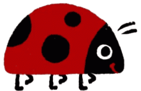

Hi My name is Ali Patvariㅤㅤㅤㅤㅤㅤㅤㅤㅤㅤㅤㅤㅤㅤ
===================================================================================================================================

I'm aï¸ QA Engineer (bug 🔠 hunter) who's all about making sure websites and apps run smoothly 💻 
 Nothing beats the thrill of coding and diving into new technologies; it's like unlocking a treasure trove of endless possibilities! 
 
<b>Bugs give me the heebie-jeebies, but automation? That's my happy place😌<b>

* 🌍  I'm based in Minneapolis
* ✉️  You can contact me at [patvariali2@gmail.com](mailto:patvariali2@gmail.com)

 

  

### My best friends:

### Socials

 <a href="https://www.linkedin.com/in/ali-patvari-3794b813a/" target="_blank" rel="noreferrer"> <picture> <source media="(prefers-color-scheme: dark)" srcset="https://raw.githubusercontent.com/danielcranney/readme-generator/main/public/icons/socials/linkedin-dark.svg" /> <source media="(prefers-color-scheme: light)" srcset="https://raw.githubusercontent.com/danielcranney/readme-generator/main/public/icons/socials/linkedin.svg" />  </picture> </a>

## 💡 Automation frameworks:

- [Web-Framework](https://github.com/patvariali/Selenium_Junit5_Cucumber)(Java, Cucumber, Junite5, Selenium, Maven, Allure)
- [Backend-testing](): (*under construction)
- [Mobile-testing](): (*under construction)

